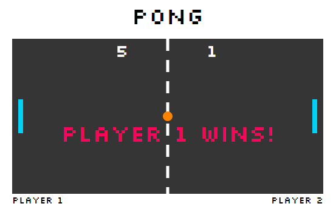

# Pong Game

This is a basic Pong game using SVGs.

JavaScript (ES2015) is used to create the SVGs, move the ball, paddles, calculate the players' score, trigger audio during game play, and declare the winner.

## Setup
Installation of various packages are required to run this game. Download the project before running the commands listed below:

**Install:**

`> npm i`

**Run:**

`> npm start`

## Keys

**Player 1:**
* a: up
* z: down

**Player 2:**
* ▲ : up
* ▼: down

**Pause:**
* spacebar: to pause

## Technologies Used
* Atom (http://atom.io)
* Beautify (https://atom.io/packages/atom-beautify)
* Swackets (https://atom.io/packages/swackets)
* Git Bash (https://git-for-windows.github.io/)
* Google Chrome (https://www.google.com/chrome/)
* Google Chrome Developer Tools
* Greenshot (http://getgreenshot.org/)
* HTML Color Codes (http://htmlcolorcodes.com/)
* JavaScript (ES2015)
* SVG (http://svgpocketguide.com/)
* WebPack (https://webpack.github.io/)
* WebPack-Dev-Server
* ESLint (http://eslint.org/)
* Babel (https://www.npmjs.com/package/babel)

## Personal Learnings
* As this was new code for me, writing out the classes at a high level helped me understand how all the classes worked together and allowed me to figure out how to implement my stretch goal and any other changes I chose to make.

* A new set of extensions and packages were used for this project, which helped in resolving syntax errors. I have used GULP in a previous project and now WebPack. Both tools are useful but are configured differently. I see the value of both tools.

* I enjoyed working with SVGs. I was pleasantly surprised how many options I have to creating SVGs and how quickly they load in comparison to an image.

* Creating a game is not an easy task. Even a simple game, such as Pong can be complex. I have a new appreciation for individuals and companies who create games.  
